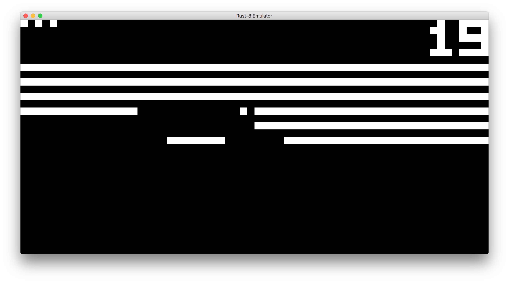

# Rust-8

Rust-8 is an implementation of the CHIP-8 virtual machine written in Rust.

## What is CHIP-8?

CHIP-8 is a virtual machine (along with a supporting programming language).
Since the CHIP-8 VM does not expose the fact that it's running on a host CPU,
in theory the VM could be translated to physical hardware.

The CHIP-8 VM was used in the late '70s on some computers such as the [Telmac
1800](https://en.wikipedia.org/wiki/Telmac_1800) and on some calculators in the
1980's.

CHIP-8 was mainly used as a gaming platform, and today you can play lots of
games like Pong and Breakout on it.

You can find a list of games [here](http://chip8.com/?page=84).

You can find more information on the [CHIP-8 wikipedia page](https://en.wikipedia.org/wiki/CHIP-8) or on the [CHIP-8 website](http://chip8.com).

## Why a CHIP-8 implementation?

I was inspired by Jake Taylor's live streaming project of building an [N64
emulator in Rust](https://github.com/yupferris/rustendo64). Having never built
an emulator myself, I searched online for easy ways to get started. The CHIP-8
is many people's first emulator because it's relatively easy and quick to finish.
I got the emulator working in less than a week, for example.

## Why Rust?

Rust is awesome. If you start a project where you think you need either C or
C++, [reach for Rust next time](https://www.rust-lang.org/).
